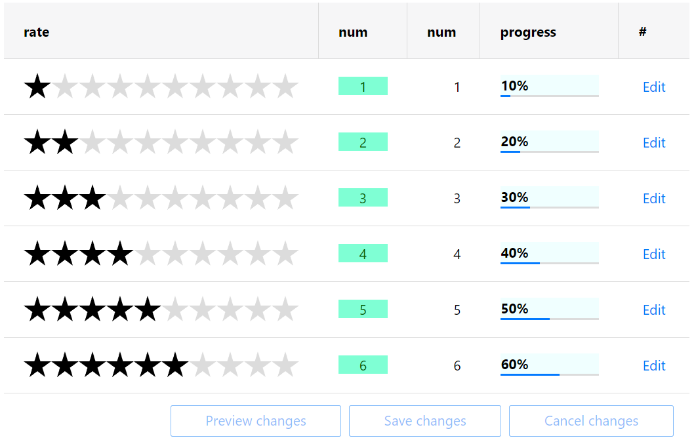

<!-- default badges list -->

[](https://supportcenter.devexpress.com/ticket/details/T506160)
[](https://docs.devexpress.com/GeneralInformation/403183)
<!-- default badges end -->
# Grid View for ASP.NET Web Forms - How to access and modify a template control in batch edit mode

This example demonstrates how to create a templated column, add content to the template, and use client-side `GetCellTextContainer` and `GetControlsByPredicate` methods to access and modify the template content in batch edit mode.



## Overview

Specify a column's [DataItemTemplate](https://docs.devexpress.com/AspNet/DevExpress.Web.GridViewDataColumn.DataItemTemplate) property and populate the template with content. To access the templated cell's container in batch edit mode, call the grid's client-side [BatchEditApi.GetCellTextContainer](https://docs.devexpress.com/AspNet/js-ASPxClientGridViewBatchEditApi.GetCellTextContainer(visibleIndex-columnFieldNameOrId)) method. To get any client objects within the specified container, call the client-side [GetControlsByPredicate](https://docs.devexpress.com/AspNet/js-ASPxClientControlCollection.GetControlsByPredicate(predicate)) method.

```js
function GetControl(visibleIndex, column) {
    return ASPx.GetControlCollection().GetControlsByPredicate(function (c) {
        var parent = grid.batchEditApi.GetCellTextContainer(visibleIndex, column);
        return ASPx.GetIsParent(parent, c.GetMainElement());
    })[0];
}
```

## Files to Review

* [AppClientCode.js](./CS/AppClientCode.js) (VB: [AppClientCode.js](./VB/AppClientCode.js))
* [Default.aspx](./CS/Default.aspx) (VB: [Default.aspx](./VB/Default.aspx))
* [Default.aspx.cs](./CS/Default.aspx.cs) (VB: [Default.aspx.vb](./VB/Default.aspx.vb))

## Documentation

* [Grid in Batch Edit Mode](https://docs.devexpress.com/AspNet/16443/components/grid-view/concepts/edit-data/batch-edit-mode)
* [Grid View Templates](https://docs.devexpress.com/AspNet/3718/components/grid-view/concepts/templates)
